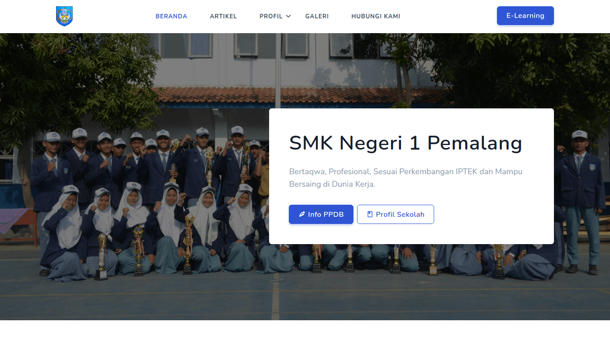

# Main Website



<p align="center">
    <a href="https://github.com/smkn1pml/website/actions/workflows/publish.yml">
        
    </a>
</p>

Built using Jekyll as a Static Site Generator, GitHub Pages as its CDN, and Netlify CMS as a Content Management System.

## Development

### Requirements

- [Ruby](https://www.ruby-lang.org/en/downloads/)
- [RubyGems](https://rubygems.org/pages/download/)
- [GCC](https://gcc.gnu.org/install/) and [Make](https://www.gnu.org/software/make/)
- [Jekyll](https://jekyllrb.com/docs/installation/)

### Installation

1. Clone this repository
   ```
   git clone https://github.com/smkn1pml/website.git
   ```

2. Change current directory to repository folder
   ```
   cd website
   ```

3. Install dependencies from Gemfile
   ```
   bundle install
   ```

4. Run jekyll
   
   - Live Development (Auto Reload)
        ```
        bundle exec jekyll serve
        ```
        
   - Build Static Site
       ```
       bundle exec jekyll build
       ```

## Additional Information

### Copyright

Copyright (c) 2021 SMK Negeri 1 Pemalang.

Developed by [Shafima Dev.](https://github.com/sProDev)

### License

Code licensed under [Apache 2.0 License](LICENSE).